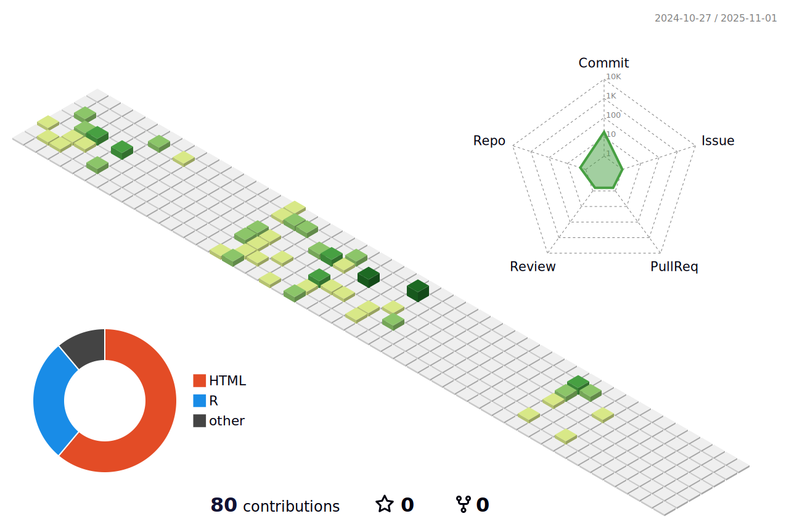

<h1 align='center'> Hi there 👋, I'm Jeffrey  👨‍💻💻 </h1>

  I live in Hamilton, New Zealand and work at <b><a href="https://www.tewhatuora.govt.nz/" target="_blank">Health New Zealand</a></b> 

  

  &nbsp;&nbsp;&nbsp;&nbsp;
  &nbsp;&nbsp;&nbsp;&nbsp;
  &nbsp;&nbsp;&nbsp;&nbsp;

&nbsp;&nbsp;

<h3 align='left'> Who Am I?! 👻❓</h3>

 Hi!👋 I'm Jeffrey from New Zealand. I currently work as a data scientist for Health New Zealand after graduating with first class honours in both data analytics 🔢 and computer science. ğŸ–¥ï¸ I have worked with major clients in New Zealand during my time at <a href="https://www.lumaanalytics.com/" target="_blank">Luma Analytics</a> and it was during this time, my desire for further studies was encouraged. As a result of this, I now find myself progressing through my masters in computer science at the University of Waikato.📠 &nbsp;&nbsp;
  
I have a particular interest in time series analysis/modelling and geospatial analysis. This includes many work with <a href="https://www.esri.com/en-us/arcgis/about-arcgis/overview" target="_blank">ESRI ArcGIS</a> and <a href="https://kepler.gl/" target="_blank">Kepler.gl</a> for showcasing prediction based results. I am a firm believer that an optimal use of data is one of the primary factors to the success of a business or organization. &nbsp;&nbsp;
  
* 🎯 I'm currently focusing on: Building a decision making tool for all parts of a T20 match through partnership with <a href="https://sussexcricket.co.uk/" target="_blank"><b>Sussex County Cricket</b></a>. 🇬🇧 🏏 &nbsp;&nbsp; 
  
* 💬**Ask me about:** Java, Python, R, Database, Big Data, SQL, Power BI & Qlik, Databricks, Modelling & Optimization, Geospatial Analysis, Project Management, Scala.&nbsp;&nbsp;
  
* 📫**How to reach me:** Catch and follow me from the above links☝️, in addition to following me here. &nbsp;&nbsp;
  
* ⚡**Fun fact:** I love 🏏,⚽,☕ and 🎮.&nbsp;&nbsp;
  
  
Please reach out if you are interested in working with me on any projects! I am always happy to contribute! 😊&nbsp;&nbsp;

 

  &nbsp;&nbsp;&nbsp;

 

**NOTE:** _Top languages does not indicate my skill level. It is Github's metric of which languages I have the most code on Github._ &nbsp;&nbsp;

  
  

 
  
  
<h2 align='center'> Contributions History </h2>

